# Operation Industrial Virtual Assembly!!  
### _Aurora Robotics Robotic Arm Modelling [Task 4]_  
---

## The Story

With the **skyrocketing rise of robotics talent** and the consistent showcase of expertise by **Aurora Robotics Students**, major players in the global robotics scene have taken notice.

These companies ranging from industrial automation to collaborative robotics and quadruped systems have reached out to **Aurora Robotics** for one goal:

> “We’ve built the mechanical design.  
> You’ve mastered the simulation.  
> Let’s bring our robots to life, virtually.”

Each company has provided their **mechanical CAD models** (STL/DAE) for the Aurora Robotics Students to assemble, describe, and simulate using **ROS 2**.  
Your job is to transform these files into fully functional **URDFs**, visualize them in **RViz 2**, and prepare them for simulation in **Gazebo**.

---

## 🧰 The Task

[**READ TASK GUIDE HERE**](task4-guide/README.md)

### 🎯 Objective
Convert each company’s CAD model into a working URDF robot description using ROS 2.

### ⚙️ Steps

1. **Locate the Robot Folder**  
   Each folder in this repository corresponds to a real-world robot (e.g., `fanuc-m710ic50`, `franka-arm`, `unitree-a1-dog`, etc.).  
   Inside, you’ll find:
   - CAD meshes (`.stl` / `.dae`)
   - A `final_result/` folder with real-life reference images of the robot.

2. **Assemble the URDF**
   - Define each link and joint in a `.urdf` or `.xacro` file.  
   - Use appropriate coordinate frames, limits, and inertial properties.  
   - Include visual and collision meshes from the folder.

3. **Visualize in RViz 2**
   ```bash
   ros2 launch urdf_tutorial display.launch.py model:=/absolute/path/to/your_robot.urdf
   ```
   You should see the robot fully rendered and movable via the Joint State Publisher GUI.

4. **Simulate Later**
   Once validated, extend your work into Gazebo or Ignition for physics simulation and control.

---

## 🏗️ Repository Structure

```
.
├── fanuc-m710ic50/
│   ├── base_link.stl
│   ├── link_1.stl
│   ├── ...
│   └── final_result/
│       ├── 1.png
│       └── 2.jpg
├── franka-arm/
│   ├── link0.dae
│   ├── link1.dae
│   ├── ...
│   └── final_result/
│       ├── 1.png
│       └── 2.png
├── kortex-gen3-lite/
├── kuka-iiwa-14/
├── kuka-med-14/
├── ufactory-xarm-lite-6/
├── ufactory-xarm-uf850/
├── ufactory-xarm7/
├── unitree-a1-dog/
├── unitree-go-1-dog/
├── universal-robots-ur3/
├── universal-robots-ur15/
└── universal-robots-ur30/
```

---

## 🤖 Robots in This Repository

Below are the robots provided by each company.  


 
## 🟨 FANUC M-710iC/50

Industrial robotic arm widely used for material handling and automation tasks.  
Used for precision pick-and-place operations and payloads up to 50 kg.  

#### 📸 Final Result  
<p align="center">
  
  
</p>

---

## 🤝 Franka Emika Panda

A lightweight 7-DOF collaborative robot designed for precision manipulation and research.  
Known for smooth joints and torque sensing, great for labs and education.

#### 📸 Final Result
<p align="center">
  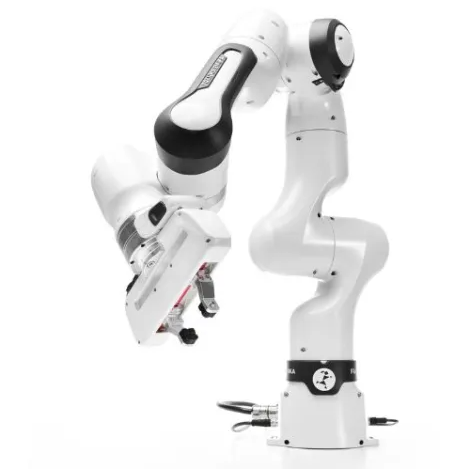
  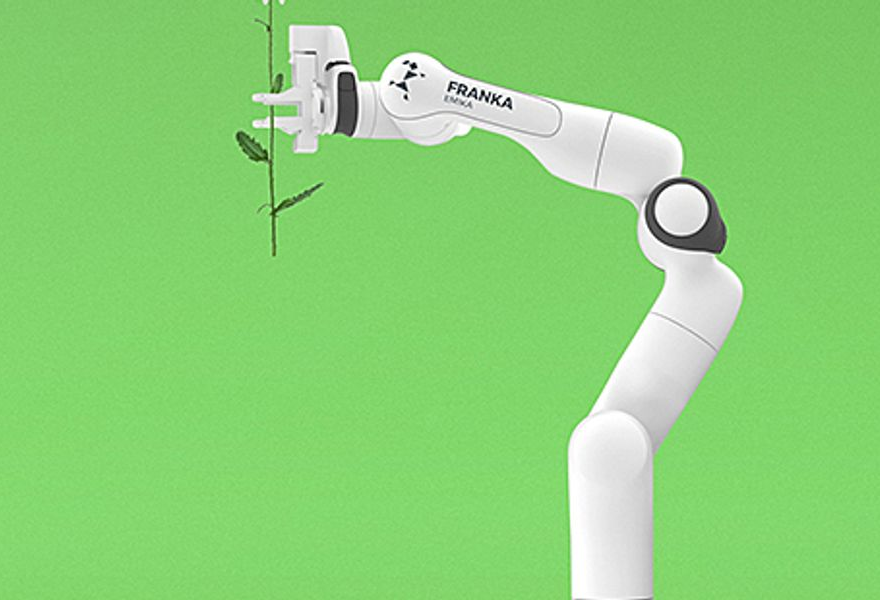
</p>


---

## 🦾 Kinova Kortex Gen3 Lite

A compact 6-DOF robotic arm designed for research, education, and light manipulation tasks.  
It’s known for its modular design, easy integration with ROS, and lightweight build.

#### 📸 Final Result
<p align="center">
  
  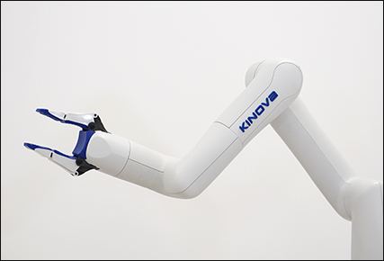
</p>

---

## 🧡 KUKA IIWA 14

A 7-DOF lightweight industrial robot designed for precision handling and sensitive assembly tasks.  
The IIWA (Intelligent Industrial Work Assistant) is widely used in research for human-robot collaboration and compliant control.

#### 📸 Final Result
<p align="center">
  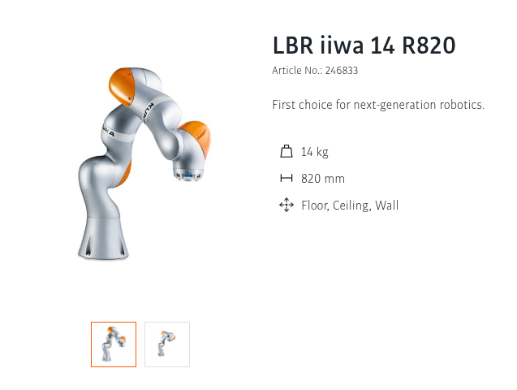
  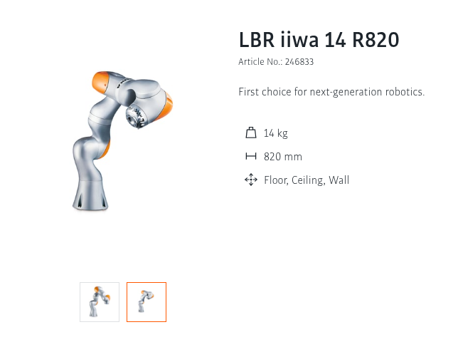
</p>

---
## 🧡 KUKA MED 14

A medical-grade variant of the KUKA IIWA series, designed for high precision and safety in surgical and healthcare applications.  
The KUKA MED 14 combines accuracy, smooth motion, and hygienic design for use in collaborative medical environments.

#### 📸 Final Result
<p align="center">
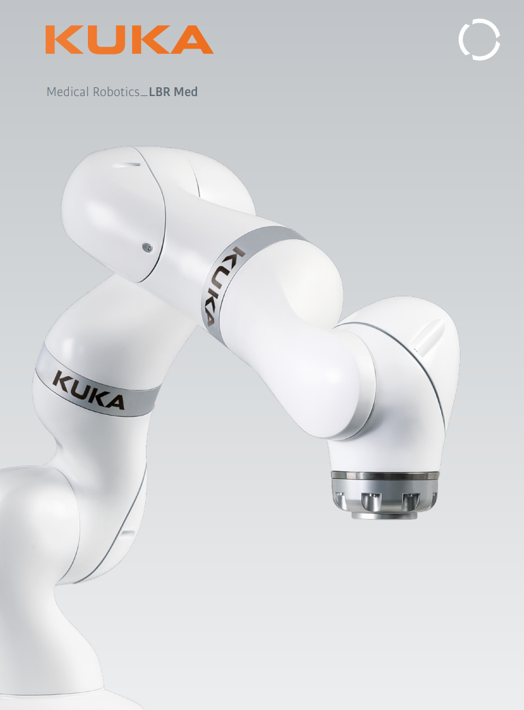
  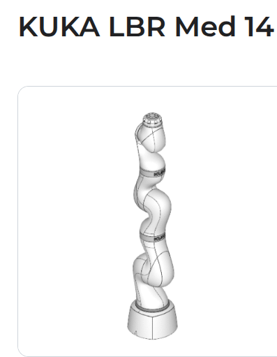
  
</p>

---
## ⚙️ UFactory xArm UF850

The xArm UF850 is a high-precision collaborative robot from UFactory designed for industrial-grade applications.  
It features a larger reach and payload capacity, making it ideal for automation, testing, and research environments.

#### 📸 Final Result
<p align="center">
  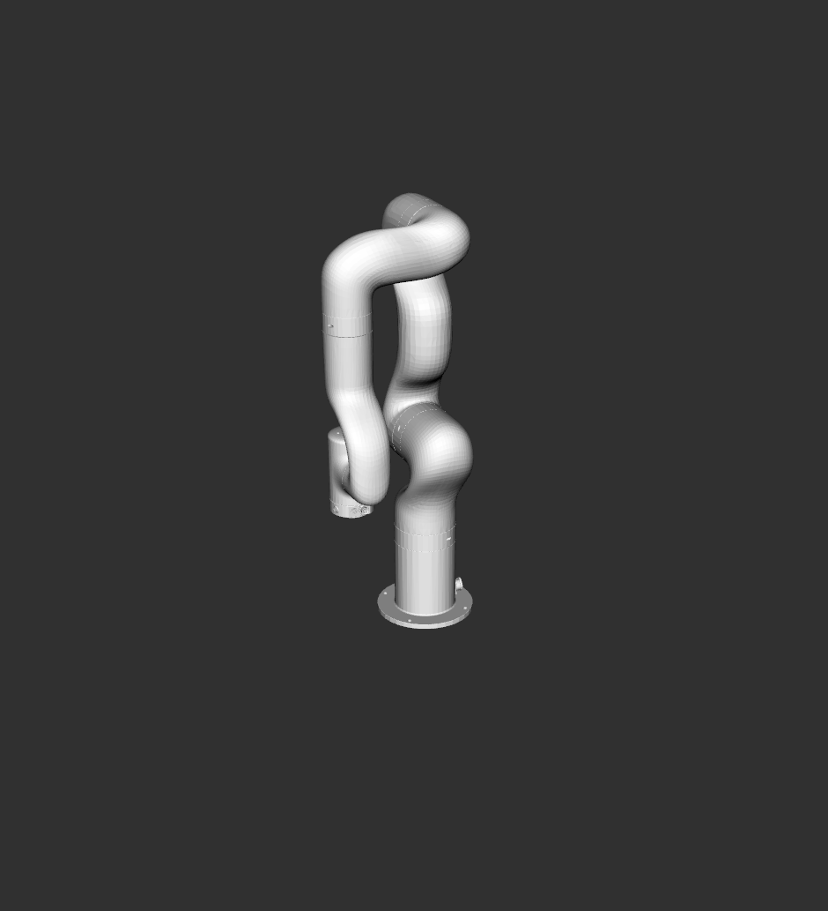
  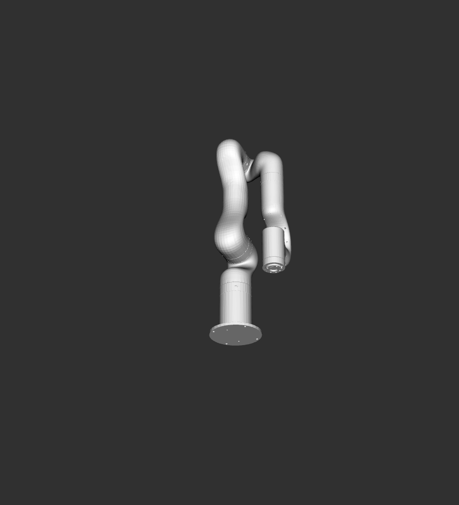
</p>

---
## ⚙️ UFactory xArm 7

The UFactory xArm 7 is a 7-axis collaborative robot known for its flexibility and precision.  
It’s widely used in research, education, and automation setups for dynamic manipulation and trajectory control.

#### 📸 Final Result
<p align="center">
  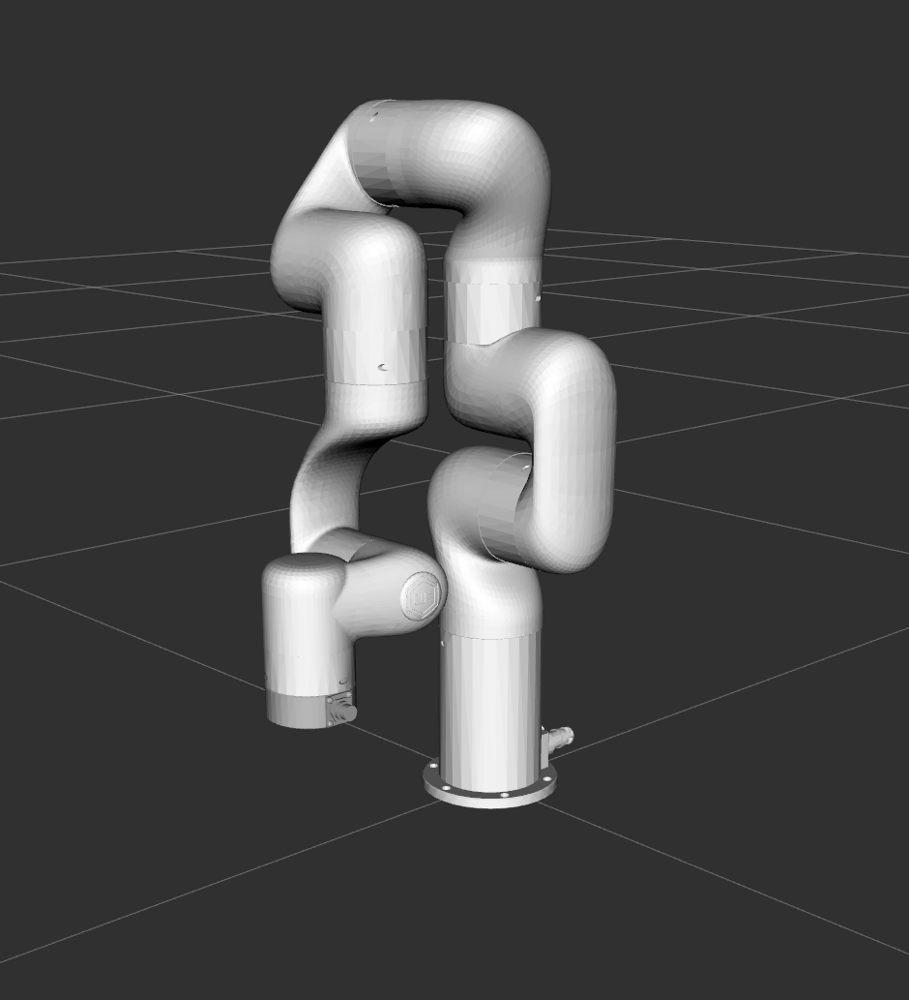
  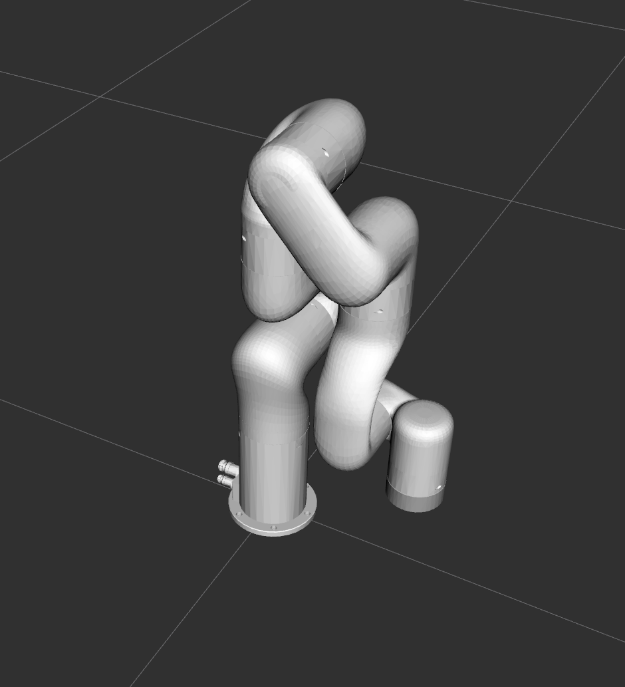
</p>

---

## 🐕 Unitree A1 Dog

The Unitree A1 is a quadruped robot known for its agility, dynamic balance, and intelligent motion control.  
It’s capable of navigating diverse terrains and performing real-time motion adjustments using onboard sensors and AI algorithms.

#### 📸 Final Result
<p align="center">
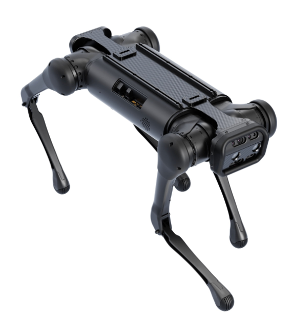
  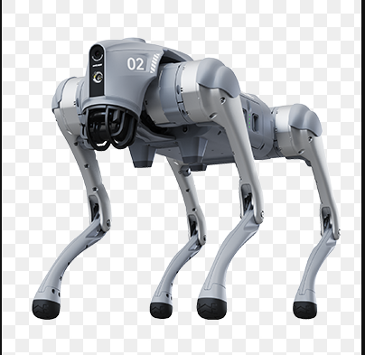
  
</p>

---
## 🐕 Unitree Go1 Dog

The Unitree Go1 is an advanced quadruped robot designed for research, inspection, and autonomous navigation.  
It features high-speed locomotion, onboard computing, and AI-based obstacle detection — ideal for real-world robotics experimentation.

#### 📸 Final Result
<p align="center">
  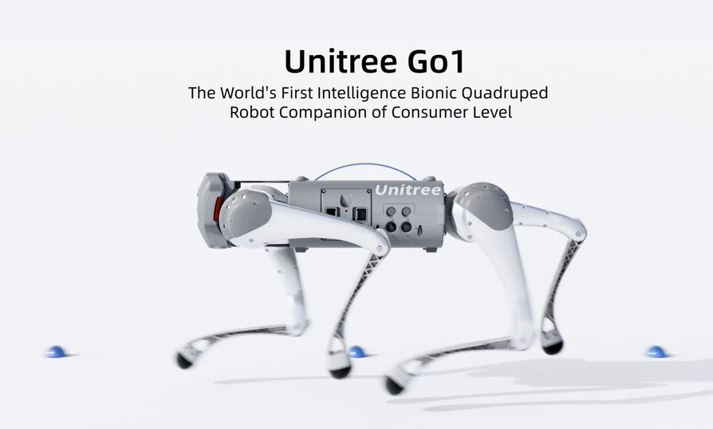
  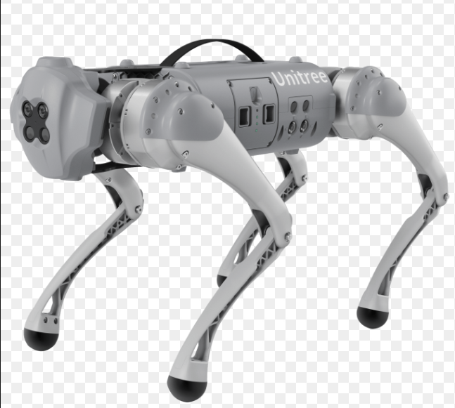
</p>

---
## 🔵 Universal Robots UR3

The Universal Robots UR3 is a compact 6-axis collaborative robot designed for light assembly and research tasks.  
It offers high precision and flexibility, making it ideal for desktop automation and educational robotics projects.

#### 📸 Final Result
<p align="center">
  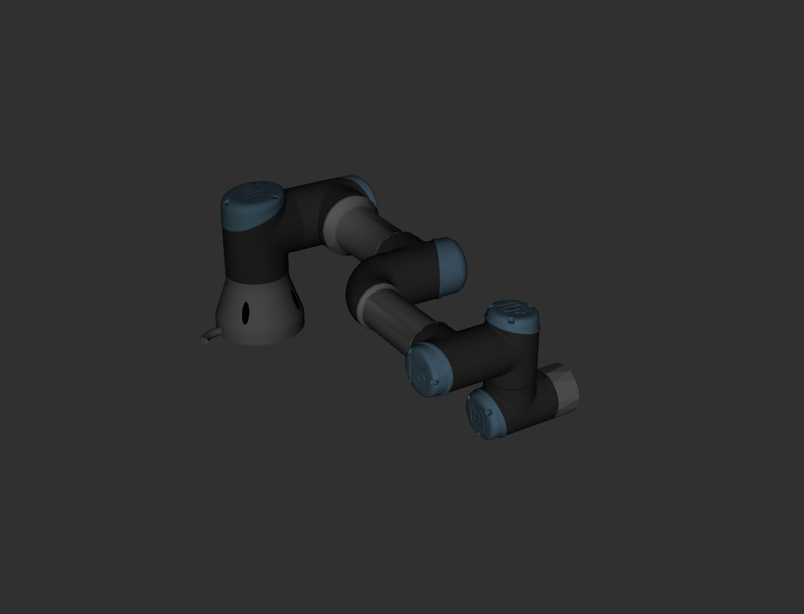
  
</p>

---
## 🔵 Universal Robots UR15

The Universal Robots UR15 is a larger, high-payload collaborative arm designed for industrial automation.  
It offers extended reach and strength while maintaining the precision and safety of the UR family.

#### 📸 Final Result
<p align="center">
  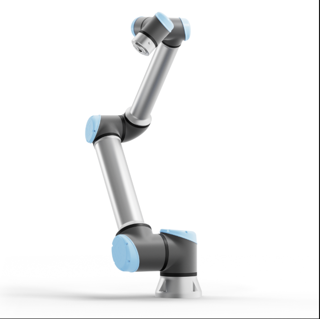
  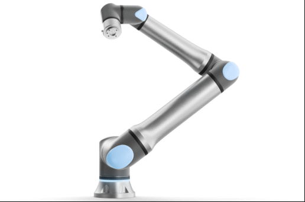
</p>

---

## 🔵 Universal Robots UR30

The Universal Robots UR30 is the newest high-performance collaborative arm from UR, offering even greater payload capacity and reach.  
It’s designed for advanced manufacturing, research, and flexible automation tasks that require both precision and strength.

#### 📸 Final Result
<p align="center">
  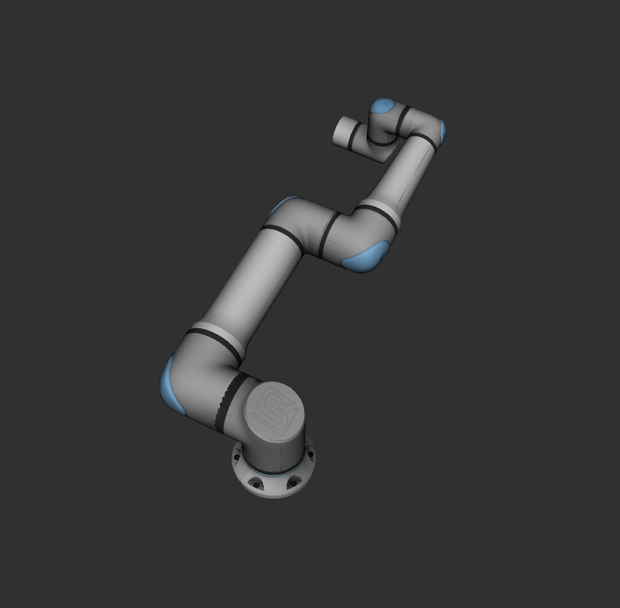
  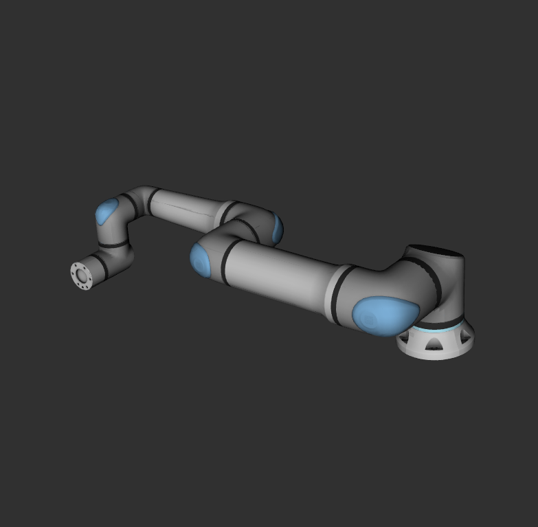
</p>

--

## 🧭 Deliverables for Students

Each Aurora Robotics Student should:

1. Build a valid **URDF/Xacro** for the assigned robot.  
2. Include **link and joint definitions** with visuals and collisions.  
3. Verify structure in **RViz 2** using:
   ```bash
   ros2 launch urdf_tutorial display.launch.py model:=<path_to_urdf>
   ```
4. Document the workflow:
   - Conversion pipeline (CAD → Mesh → URDF)  
   - Tools used (FreeCAD, Blender, etc.)  
   - Challenges and fixes  
   - Screenshots of final visualization

---

## 🏁 Mission Summary

At **Aurora Robotics**, students don’t just learn robotics,
they collaborate, innovate, and deliver industry-grade simulations that bridge mechanical design and intelligent control.

This repository represents **a living showcase** of Aurora Students’ engineering power, creativity, and discipline.

> “The world is watching. The companies are waiting.  
> Let’s show them how Aurora Students build the future before it’s built.”

---

**🚀 Aurora Robotics Core Workshop – Operation Virtual Assembly (Cohort 1)**  
_Brought to you by Aurora Robotics Students under the guidance of Bakel Bakel_
