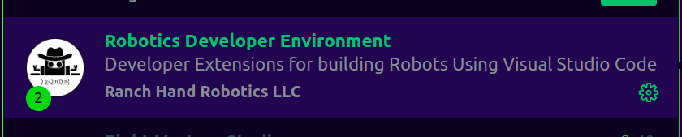
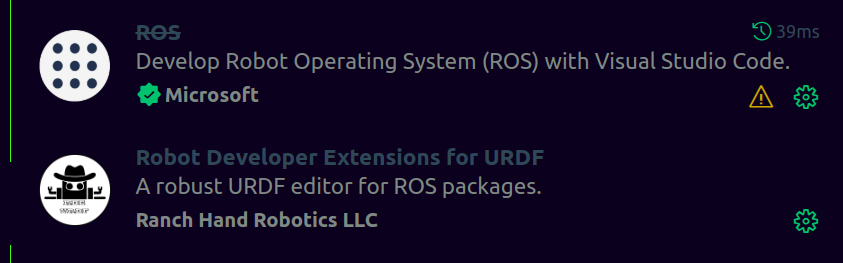
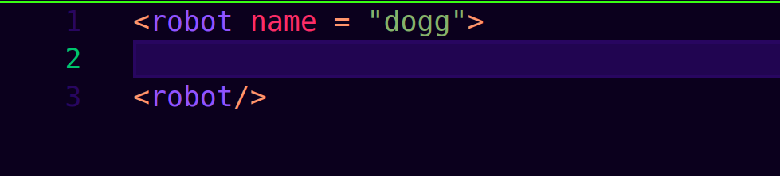

## TASK GUIDE

1. Fork the repo 

```bash

https://github.com/Bakel-Bakel/aurora-task-4

```

2. Clone it

3. Head over to your robot folder (From the lot, Bakel will share it on the group)

4. Open your folder, e.g fanuc-m710ic50/

5. All folders have the same structure. Some with STL, others with dae.

# Overall Goal

Is to build (assemble) the robot such that it resembles the pictures in the final_result folder.

---
## What tools should you have before hand.

1. If you have solidworks, perfect.

2. Meshlab and FreeCAD
3. Fusion360

```bash
sudo apt install meshlab -y
```

# START WORKING

1. Create a ROS2 Package.
2. Create a new folder outside the cloned folder.
3. Copy your assigned robot folder into the new folder. 

Command for creating the package

```bash
ros2 pkg create dogg_description --build-type ament_cmake
```

4. Create a new folder inside the new package you have just created. Name the folder "meshes"

5. Copy the cad (STL or dae) from the your initial robot folder (assigned) into the meshes folder.

6. Inspect your meshes. Just to get an idea of what they look like. If for any reason you want to tamper with the mesh, feel freeeeeeee

7. If you want to use meshlab
```bash
sudo apt install meshlab -y
meshlab link.dae
meshlab link.stl
```

8. Create a folder called urdf in you package folder.

## START URDF-ing

Install the following extensions, life will be easier.






In writing a urdf, everything in the urdf must be enclosed in a robot tag.


guide to build your urdf is in the recording

Build your package from the ws folder.

```bash
colcon build --symlink-install
```

After you build, you should source

```bash
source install/setup.bash
```
If you want to visualise in rviz

```bash
ros2 launch urdf_tutorial display.launch.py model:=$PWD/dogg_description/urdf/dogg.urdf 
```


format for urdf

```xml
<robot name = "dogg">
    <link name="base_link">
        <visual>    
            <geometry>
              <mesh filename="package://dogg_description/meshes/trunk.dae" scale="1.0 1.0 1.0"/>
            </geometry>
        </visual>
    </link>

</robot>
```
How to use joints.

```xml
<robot name = "dogg">

    <link name="base_link">
        <visual>
            <origin xyz = "0 0 0" rpy = "0 0 0"/>   
            <geometry>
              <box size="0.01 0.01 0.01"/>
            </geometry>
        </visual>
    </link>

    <link name="trunk">
        <visual>
            <origin xyz = "0 0 0" rpy = "0 0 0"/>   
            <geometry>
              <mesh filename="package://dogg_description/meshes/trunk.dae" scale="1.0 1.0 1.0"/>
            </geometry>
        </visual>
    </link>

    <link name="thigh_1">
        <visual>
            <origin xyz = "0 0 0" rpy = "0 0 0"/>   
            <geometry>
              <mesh filename="package://dogg_description/meshes/thigh.dae" scale="1.0 1.0 1.0"/>
            </geometry>
        </visual>
    </link>

   
    <joint name="base_link_to_trunk" type="fixed">
        <origin xyz="0 0 0" rpy="0.0 0.0 0.0"/>
        <parent link="base_link"/>
        <child link="trunk"/>
       
    </joint>

    <joint name="trunk_to_thigh_1" type="revolute">
        <origin xyz="0 0.15 0" rpy="0.0 0.0 0.0"/>
        <parent link="trunk"/>
        <child link="thigh_1"/>
        <axis xyz="0 1 0"/>
        <limit lower="-3.14" upper="3.14" effort="0" velocity="0"/>
    </joint>


</robot>
```

